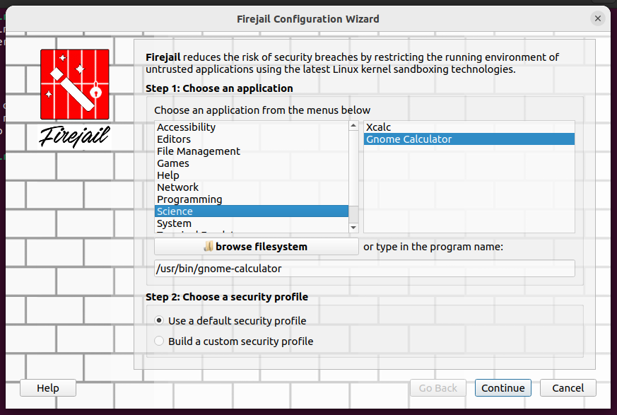
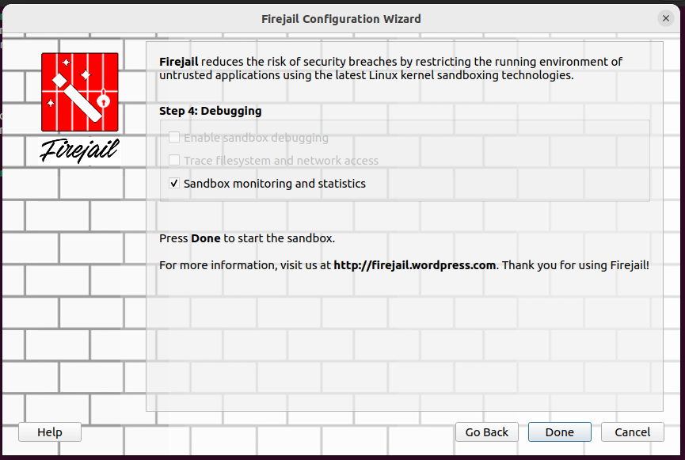
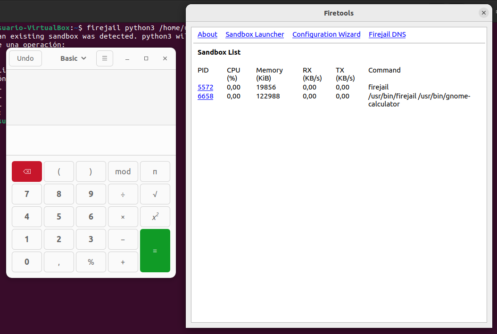
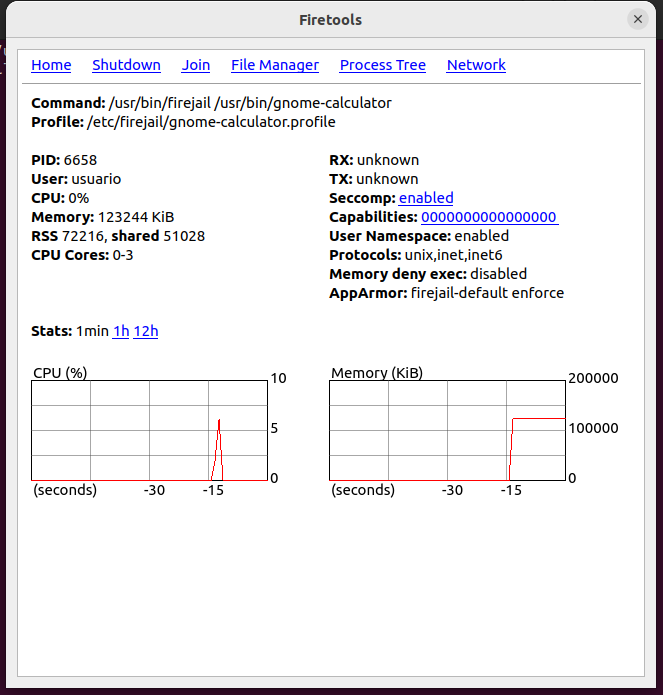
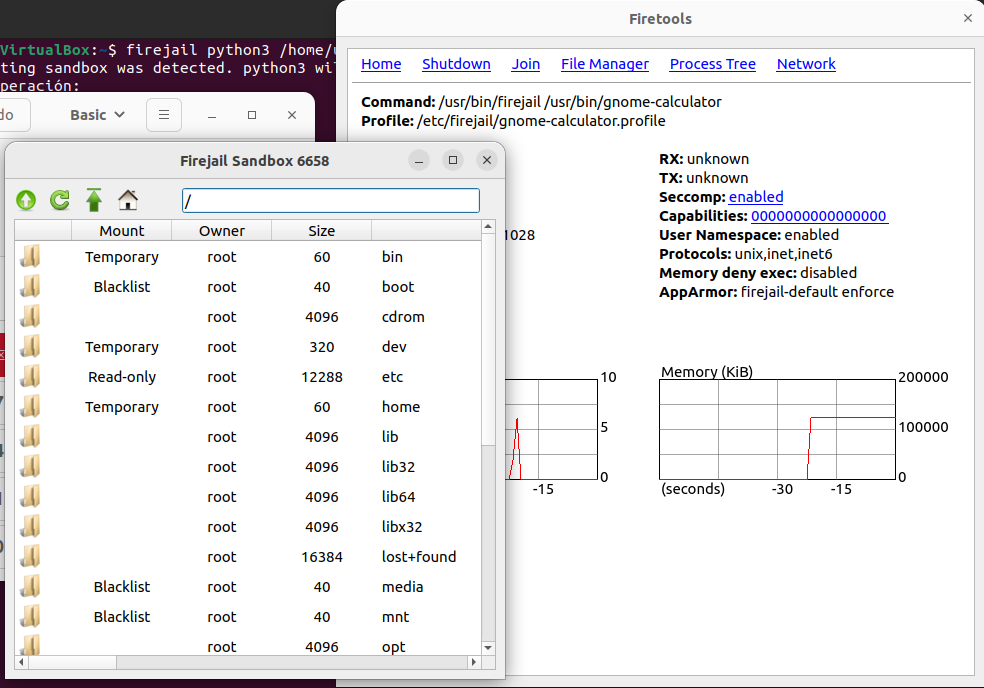

# Actividad 4 sandbox

## Sandbox
Es un método para ejecutar aplicaciones de forma aislada evitando así ser infectados por malware o otro tipo de inseguridades que podrían generarse al ejecutarse en la máquina host sin hacer uso de un sandbox.

En mi caso he instalado Firejail

Instalación:
```bash
sudo apt-get install firejail
sudo apt-get install firetools
```

Para ejecutar mi aplicación de pyhton he usado el siguiente comando.

```bash
firejail python3 calculadoraBasica.py
```

Una vez instalado al ejecutarlo muestra un menú organizado por tipo de aplicaciones que podemos ejecutar dentro del sandbox.

Seleccionaremos la aplicación que queremos ejecutar de forma aislada. (En mi caso la terminal)



Al pulsar **Continue**, nos muestra una ventana con diferentes opciones que afectarán a las herramientas que se nos van a ofrecer a la hora de la ejecución.



En mi caso marco la casilla de **Sandbox monitoring and statistics** para que muestre información de la aplicación. (Y pulso **Done**)



Esta ventana muestra la aplicación en ejecución y una información básica sobre los procesos que hay en ejecución.

En la parte superior de la ventana podemos ver un menú donde podemos configurar un proxy entre otras cosas.

Dentro de las ventana de los procesos podemos ver que tienen un identificador asociado al que podemos acceder clicando sobre él.



La ventana muestra el consumo de recursos que tiene la aplicación que hay en ejecución y un menú superior donde podemos ver los fichero que se han modificado con la ejecución entre otras cosas.


